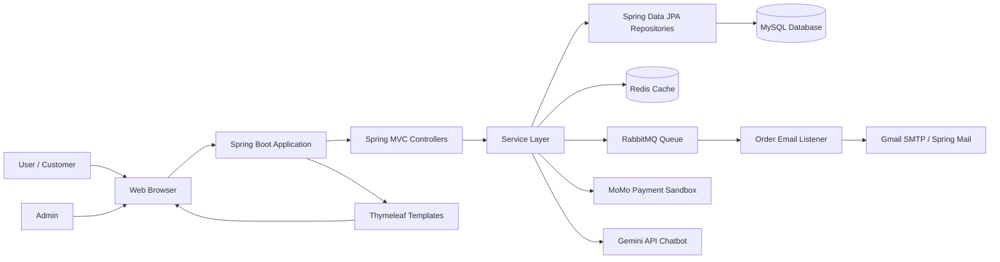
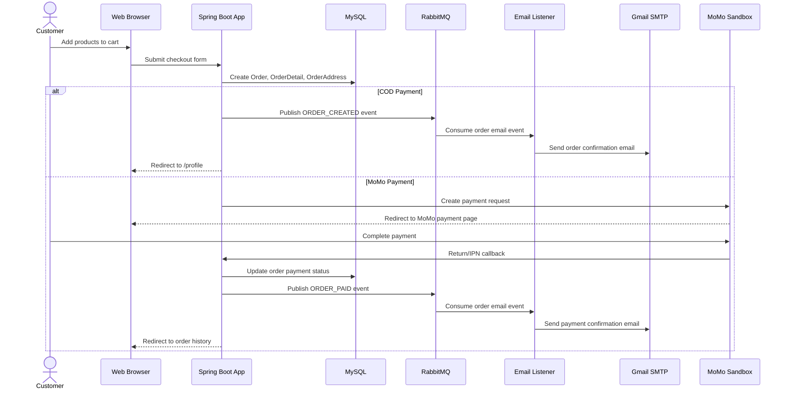
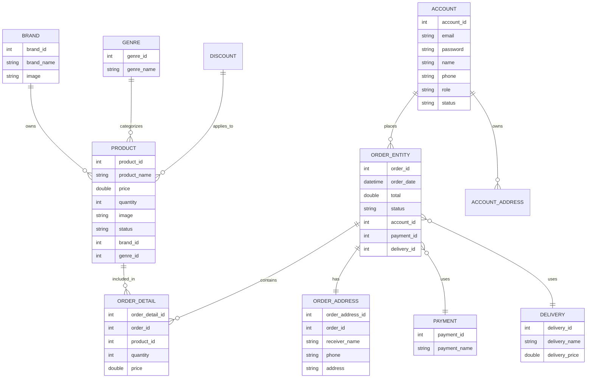
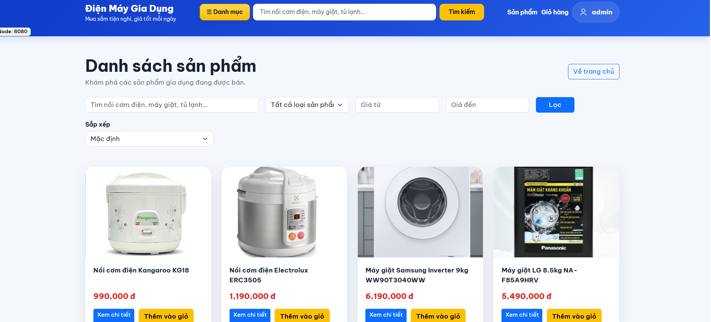
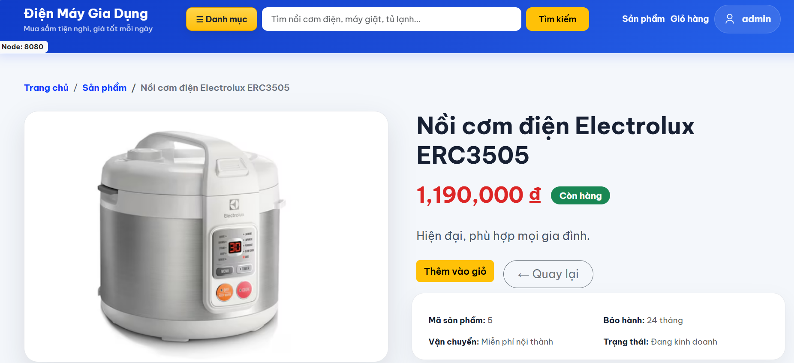
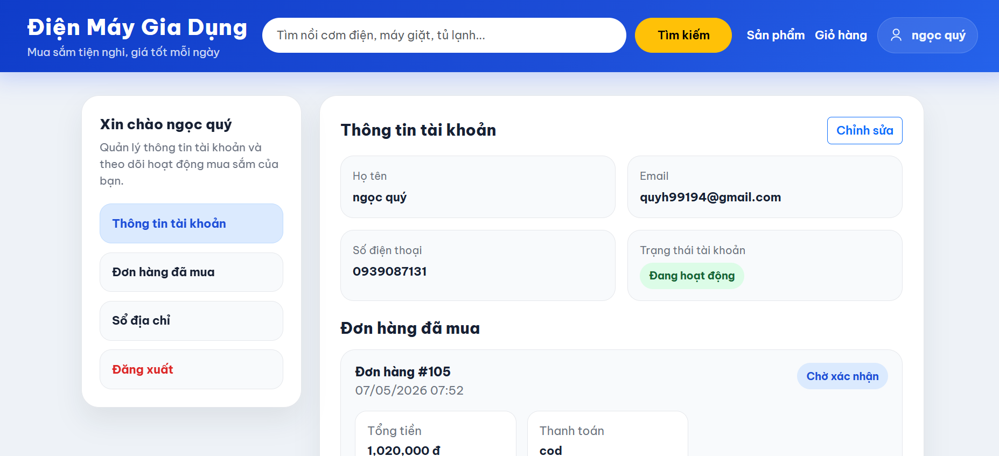
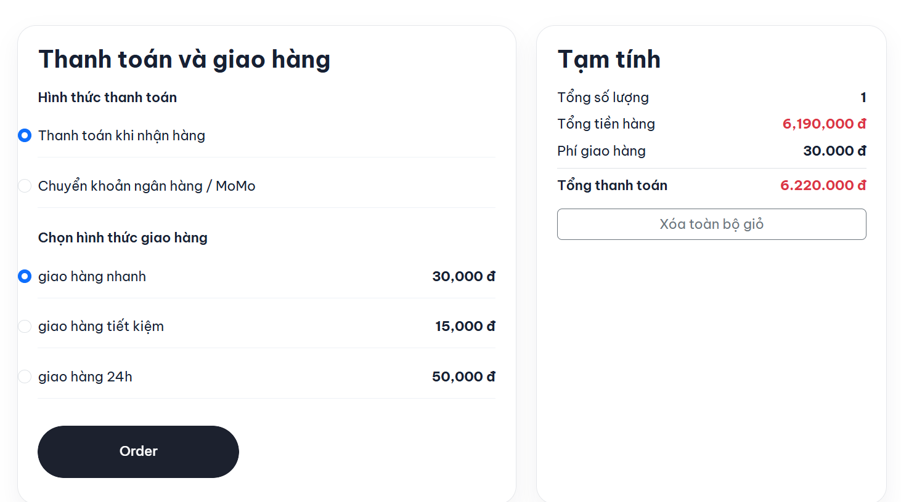
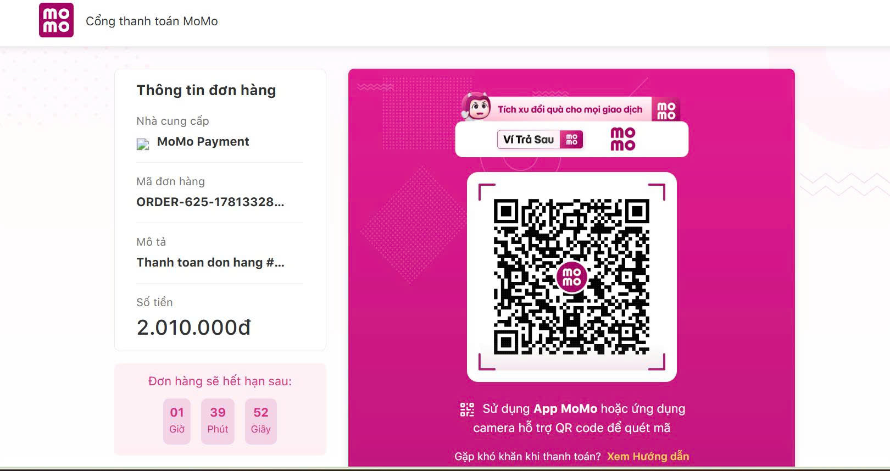
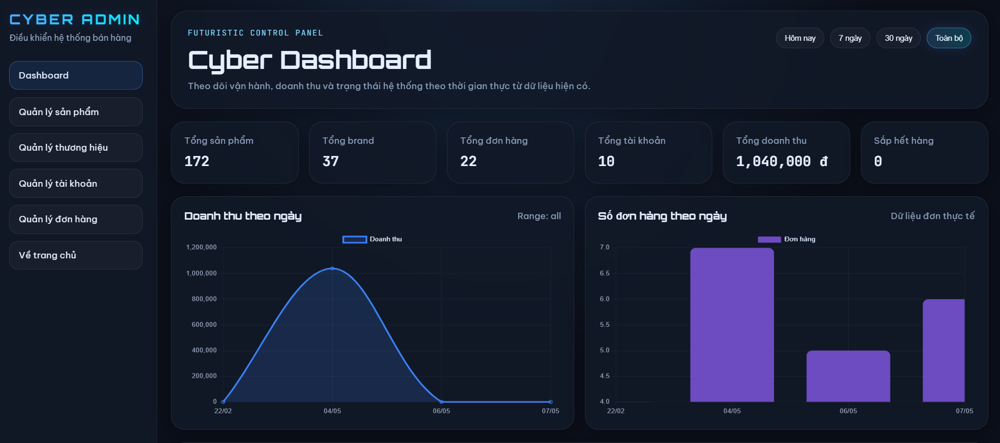
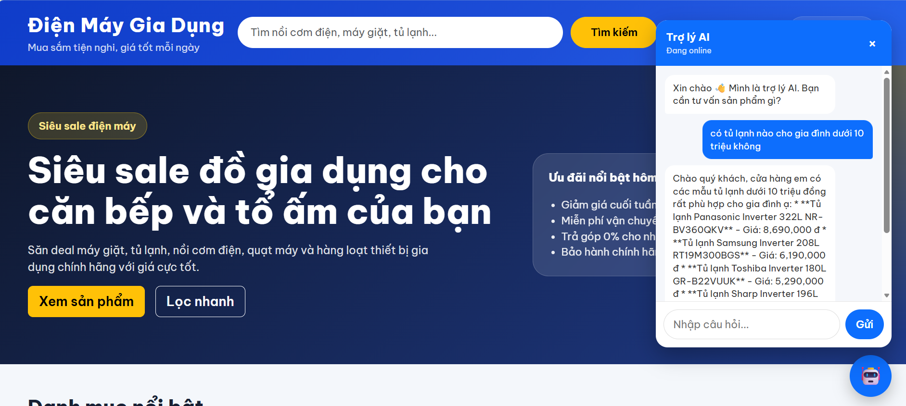

# Household Appliances E-commerce Platform

A full-stack e-commerce web application for household appliance sales, built with Spring Boot, MySQL, and Thymeleaf.

The system supports product browsing, shopping cart management, checkout, COD/MoMo payment, order management, admin management, and AI-powered product consultation using Gemini API.

---

## Features

- Product listing and product detail pages
- Shopping cart and checkout
- COD and MoMo payment integration
- User authentication and authorization
- Admin product and order management
- AI chatbot for product consultation using Gemini API
- Redis caching/session-related data management
- RabbitMQ asynchronous order confirmation emails

---

## Tech Stack

### Backend

- Java
- Spring Boot
- Spring MVC
- Spring Security
- Spring Data JPA
- Hibernate
- Spring Mail
- Redis
- RabbitMQ
- MySQL
- Gemini API
- MoMo Payment API

### Frontend

- HTML
- CSS
- JavaScript
- Bootstrap
- Thymeleaf

## System Architecture



## 2. Checkout Flow Diagram

```md
## Checkout Flow Diagram
```


## 3. Database Relationship Diagram

```md
## Database Relationship Diagram
```


---

## How to Run

### 1. Clone the repository

```bash
git clone https://github.com/ng-quys/Household-Appliances-E-commerce-Platform.git
cd Household-Appliances-E-commerce-Platform
```

### 2. Create MySQL database

```sql
CREATE DATABASE household_appliances_db;
```

### 3. Start Redis and RabbitMQ with Docker

This project uses Redis for caching/session-related data and RabbitMQ for asynchronous order confirmation emails.

Start RabbitMQ:

```bash
docker run -d --name mango-rabbitmq \
  -p 5672:5672 \
  -p 15672:15672 \
  -e RABBITMQ_DEFAULT_USER=mango \
  -e RABBITMQ_DEFAULT_PASS=123456 \
  rabbitmq:3-management
```

Start Redis:

```bash
docker run -d --name mango-redis \
  -p 6379:6379 \
  redis:7
```

If containers already exist:

```bash
docker start mango-rabbitmq
docker start mango-redis
```

RabbitMQ Management UI:

```text
http://localhost:15672
```

Default RabbitMQ account:

```text
Username: mango
Password: 123456
```

### 4. Configure `application.properties`

```properties
spring.datasource.url=jdbc:mysql://localhost:3306/household_appliances_db
spring.datasource.username=root
spring.datasource.password=your_password

# Redis
spring.data.redis.host=${REDIS_HOST:localhost}
spring.data.redis.port=${REDIS_PORT:6379}
spring.cache.type=redis

# RabbitMQ
spring.rabbitmq.host=${RABBITMQ_HOST:localhost}
spring.rabbitmq.port=${RABBITMQ_PORT:5672}
spring.rabbitmq.username=${RABBITMQ_USERNAME:mango}
spring.rabbitmq.password=${RABBITMQ_PASSWORD:123456}

# Gemini API
gemini.api.key=${GEMINI_API_KEY:your_gemini_api_key}

# MoMo Sandbox
momo.partner-code=${MOMO_PARTNER_CODE:your_partner_code}
momo.access-key=${MOMO_ACCESS_KEY:your_access_key}
momo.secret-key=${MOMO_SECRET_KEY:your_secret_key}
```

### 5. Configure mail environment variables

The project uses Gmail SMTP to send HTML order confirmation emails.

For Linux / macOS:

```bash
export MAIL_USERNAME=your_email@gmail.com
export MAIL_PASSWORD=your_gmail_app_password
```

For Windows PowerShell:

```powershell
$env:MAIL_USERNAME="your_email@gmail.com"
$env:MAIL_PASSWORD="your_gmail_app_password"
```

### 6. Run the application

For Linux / macOS:

```bash
./mvnw spring-boot:run
```

For Windows:

```bash
mvnw.cmd spring-boot:run
```

### 7. Open in browser

```text
http://localhost:8080
```

> Note: If RabbitMQ or Redis is running inside WSL while the Spring Boot application runs on Windows/IntelliJ, replace `localhost` with the WSL IP address for `RABBITMQ_HOST` and `REDIS_HOST`.

---

## Screenshots

### Product List



### Product Detail



### Profile



### Shopping Cart



### Checkout / MoMo Payment



### Admin Dashboard



### AI Chatbot



---

## Author

**Ho Ngoc Quy**

- GitHub: https://github.com/ng-quys
- Email: hnquy08@gmail.com
